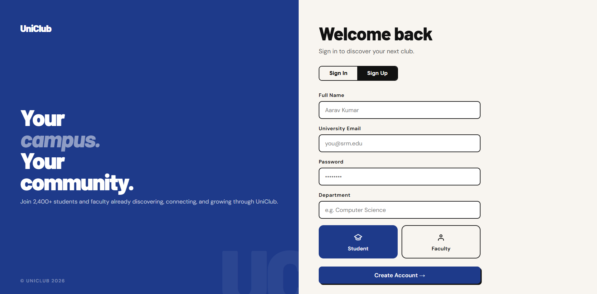
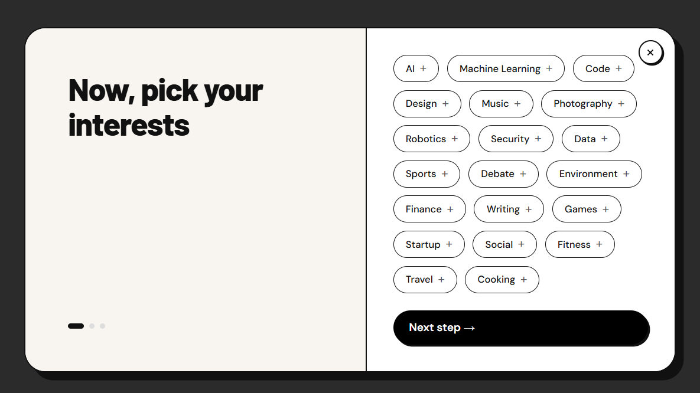
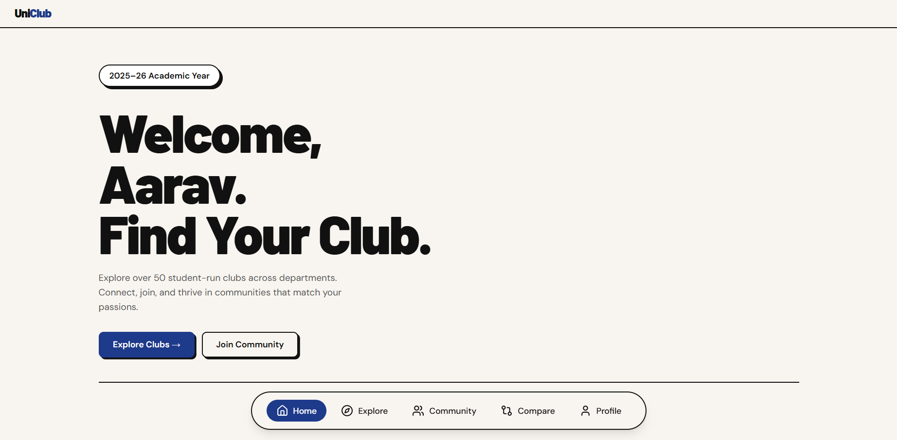
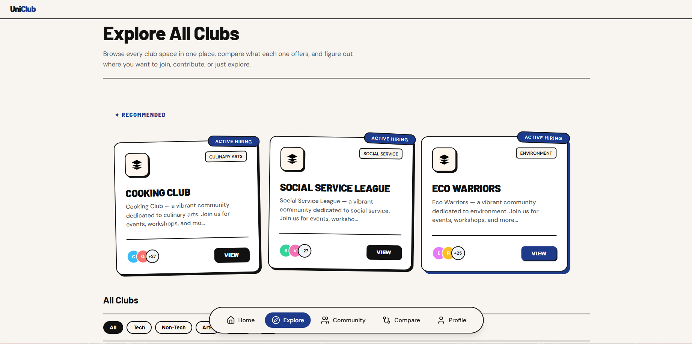
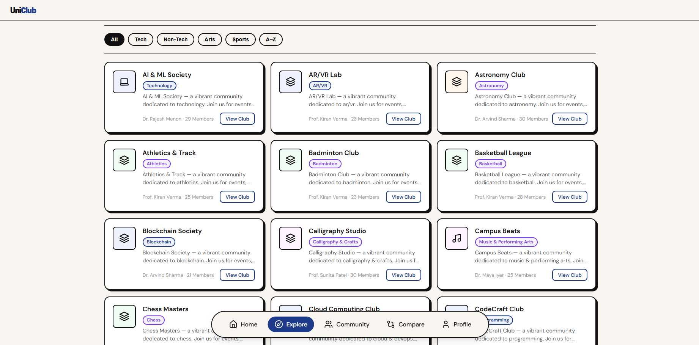
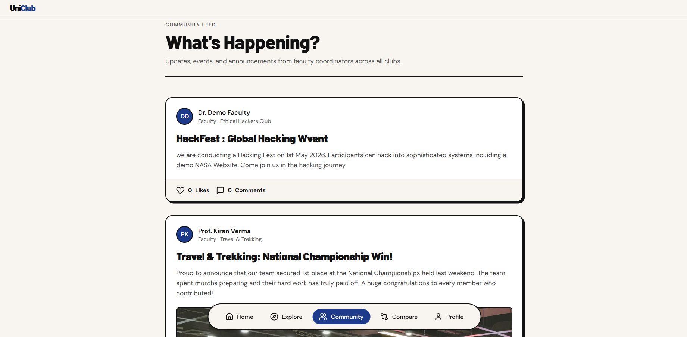
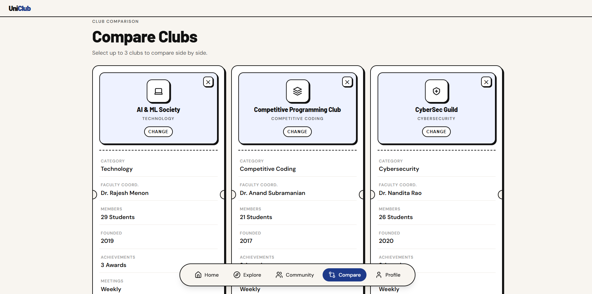
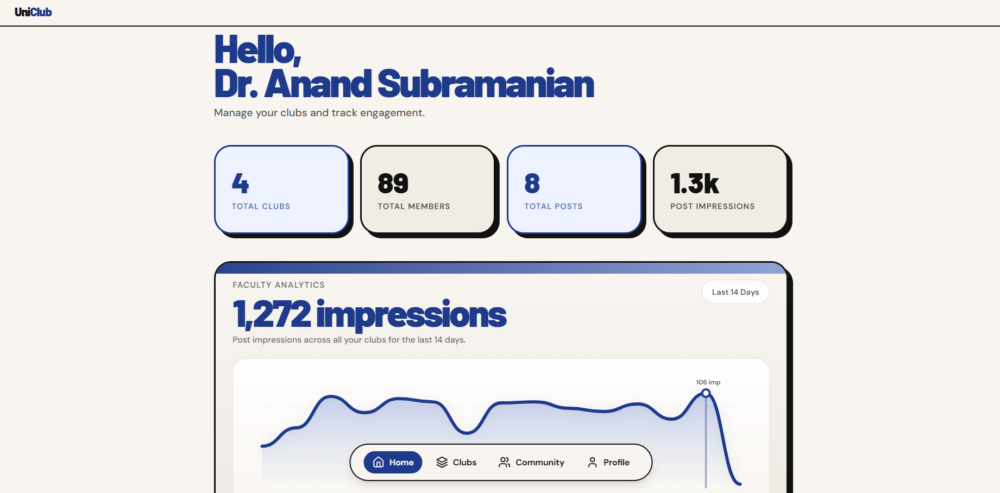
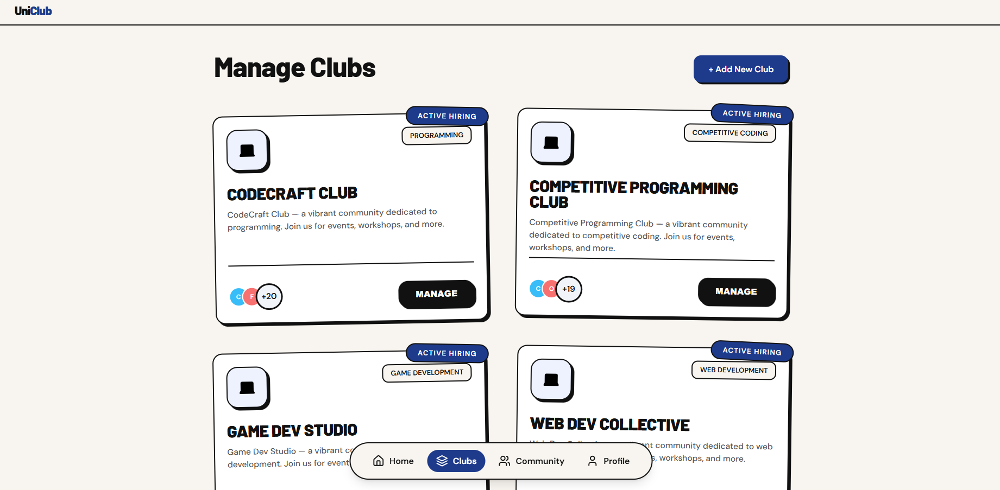
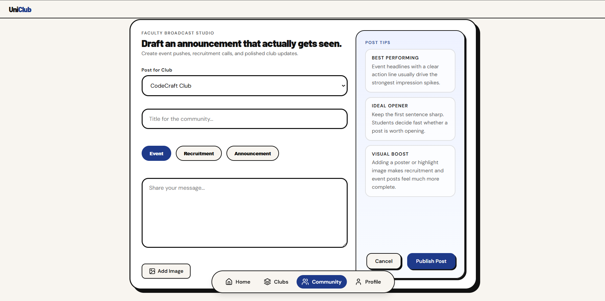

# UniClub

A full-stack university club management platform built with vanilla JavaScript and Supabase. UniClub connects students with campus organizations through personalized recommendations, community feeds, and faculty-managed club administration.

## IMAGES
**STUDENT**
 



**FACULTY**




## Table of Contents

- [Overview](#overview)
- [Features](#features)
- [Architecture](#architecture)
- [Tech Stack](#tech-stack)
- [Getting Started](#getting-started)
- [Project Structure](#project-structure)
- [Database Schema](#database-schema)
- [Configuration](#configuration)

## Overview

UniClub provides two distinct portals:

- **Student Portal** — Explore clubs, take a personality-match quiz for personalized recommendations, compare clubs side-by-side, engage with community posts, and manage memberships.
- **Faculty Portal** — Create and manage clubs, publish posts (events, announcements, achievements), manage members with role assignments, moderate comments, and track engagement analytics.

## Features

### Student Side
- Personality-match quiz with tag-based club recommendations
- Club exploration with category filters (Tech, Arts, Sports, Non-Tech)
- Side-by-side club comparison
- Community feed with likes, comments, and threaded replies
- Profile management with enrolled club overview
- Leave-request workflow for club departures

### Faculty Side
- Club CRUD with tags, social links, and status management
- Member management — add by email, assign roles, remove members
- Post publishing with image uploads (Events, Announcements, Achievements)
- Threaded comment moderation with delete controls
- Impression analytics dashboard with time-series chart
- Duplicate club name validation

### Shared
- Role-based authentication (Student / Faculty)
- Themed confirmation dialogs across all actions
- Responsive layout with dark glassmorphism design
- Real-time data via Supabase client

## Architecture

```
Browser (Vanilla JS)
    |
    +-- auth.html          Landing + login/signup
    +-- student/           Student portal (SPA-style pages)
    +-- faculty/           Faculty portal (SPA-style pages)
    |
    +-- js/
    |   +-- config.js      Supabase credentials
    |   +-- api.js         Data access layer (Supabase client)
    |   +-- app.js         Student page logic + routing
    |   +-- components.js  Shared UI components (navbar, modals)
    |   +-- data.js        Static data constants
    |
    +-- css/
    |   +-- styles.css     Global design system
    |
    +-- backend/
        +-- schema.sql     Database schema, views, RLS policies, functions
```

## Tech Stack

| Layer      | Technology                          |
|------------|-------------------------------------|
| Frontend   | HTML5, Vanilla CSS, Vanilla JS      |
| Backend    | Supabase (PostgreSQL, Auth, Storage)|
| Auth       | Supabase Auth with RLS policies     |
| Hosting    | Any static file server              |
| Fonts      | Google Fonts (Barlow, DM Sans)      |
| Icons      | Material Symbols Outlined           |

## Getting Started

### Prerequisites

- [Node.js](https://nodejs.org/) v18+
- A [Supabase](https://supabase.com/) project

### 1. Clone the Repository

```bash
git clone https://github.com/06sarv/UniClub.git
cd UniClub
```

### 2. Set Up Supabase

1. Create a new project at [supabase.com](https://supabase.com/).
2. Open the **SQL Editor** and run the contents of `backend/schema.sql` to create all tables, views, RLS policies, and functions.
3. Under **Authentication > Providers > Email**, disable "Confirm email" for development.

Update `js/config.js` with your Supabase URL and anon key:

```js
const SUPABASE_URL = 'https://your-project.supabase.co';
const SUPABASE_ANON_KEY = 'your-anon-key';
```

### 4. Run Locally

From the project root:

```bash
npx serve .
```

Open [http://localhost:3000](http://localhost:3000).

### Demo Credentials

| Role    | Email              | Password      |
|---------|--------------------|---------------|
| Student | student@demo.edu   | UniClub2025!  |
| Faculty | faculty@demo.edu   | UniClub2025!  |

## Project Structure

```
UniClub/
├── index.html              # Landing page with hero section
├── auth.html               # Authentication (sign in / sign up)
├── student/
│   ├── home.html           # Student dashboard
│   ├── explore.html        # Club discovery + recommendations
│   ├── quest.html          # Personality-match quiz
│   ├── compare.html        # Side-by-side club comparison
│   ├── community.html      # Community feed
│   └── profile.html        # Profile + membership management
├── faculty/
│   ├── home.html           # Faculty dashboard with analytics
│   ├── clubs.html          # Club management
│   ├── community.html      # Post management
│   ├── profile.html        # Faculty profile
│   ├── faculty.js          # Faculty portal logic
│   └── faculty.css         # Faculty-specific styles
├── js/
│   ├── config.js           # Supabase connection config
│   ├── api.js              # Data access layer
│   ├── app.js              # Student portal logic + routing
│   ├── components.js       # Shared UI components
│   └── data.js             # Static constants
├── css/
│   └── styles.css          # Global design system
└── backend/
    ├── schema.sql          # Full database schema
    └── package.json        # Backend dependencies
```

## Database Schema

Core tables managed via `backend/schema.sql`:

| Table              | Purpose                                    |
|--------------------|--------------------------------------------|
| profiles           | User profiles (extends Supabase Auth)      |
| clubs              | Club metadata, tags, social links          |
| club_members       | Membership records with roles              |
| posts              | Faculty-published content                  |
| post_likes         | Like records                               |
| post_comments      | Comments with threaded reply support       |
| post_impressions   | View tracking for analytics                |
| join_requests      | Leave-request workflow                     |

Key views:
- `clubs_with_stats` — Clubs joined with member counts and faculty names
- `posts_with_stats` — Posts with aggregated like, comment, and impression counts

All tables enforce Row Level Security (RLS) policies for role-based access control.

## Configuration

The Supabase configuration is managed in `js/config.js`:

The anon key is safe to expose in frontend code — Supabase RLS policies enforce access control at the database level.

## License

This project is part of an academic coursework submission.
